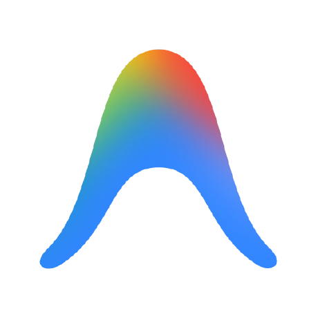
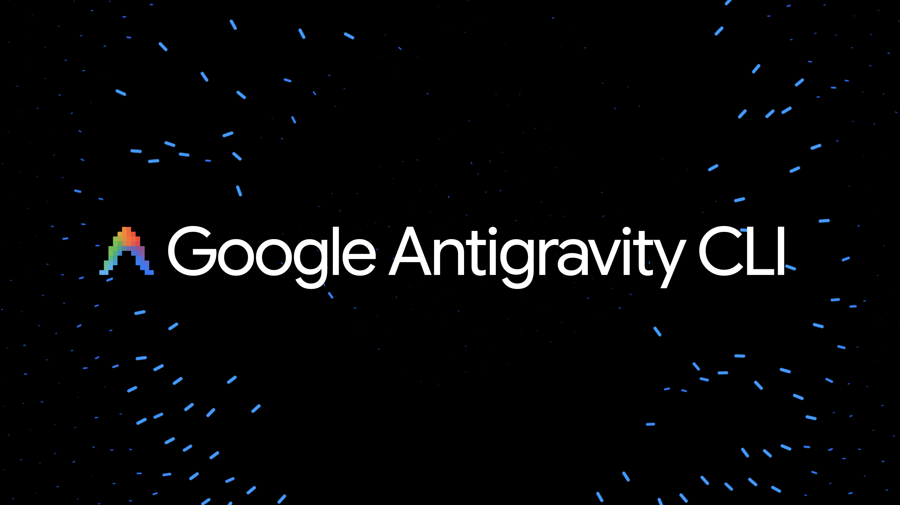

<p align="center">
  
</p>

# antigravity-cli-setup

Installer scripts and docs for the Antigravity CLI (`agy`) on Windows and Linux.
The scripts wrap Google's official installers: they download to a temp file, run it, and check that `agy` ended up on your `PATH`.

> Unofficial community project. Not affiliated with or endorsed by Google. The logo in `assets/` is an original mark, not Google's.

## Quick install

**Linux / macOS**

```bash
git clone https://github.com/YOUR-USER/antigravity-cli-setup.git
cd antigravity-cli-setup
./scripts/install.sh
```



**Windows (PowerShell)**

```powershell
git clone https://github.com/YOUR-USER/antigravity-cli-setup.git
cd antigravity-cli-setup
powershell -ExecutionPolicy Bypass -File .\scripts\install.ps1
```

**Official one-liners** (what the scripts call under the hood):

```bash
curl -fsSL https://antigravity.google/cli/install.sh | bash          # Linux / macOS
```
```powershell
irm https://antigravity.google/cli/install.ps1 | iex                 # Windows PowerShell
```

## First run

```bash
agy
```

Sign-in uses your system keyring and falls back to Google Sign-In in the browser. Over SSH it prints a URL to finish login on your local machine.

## Troubleshooting

| Problem | Fix |
| --- | --- |
| `agy: command not found` (Linux) | The installer places the binary in `~/.local/bin`. Add `export PATH="$HOME/.local/bin:$PATH"` to your shell profile. |
| `agy not found` from the Gemini CLI `/ide install` | Your desktop app installed `/usr/bin/antigravity` with no `agy` alias. Run `sudo ln -s /usr/bin/antigravity /usr/local/bin/agy`. |
| `agy` not recognized (Windows) | Open a new terminal so the updated `PATH` loads. |
| Script blocked by execution policy | Use the `-ExecutionPolicy Bypass -File` form shown above. 

## Contributing

Issues and pull requests are welcome. Run `shellcheck scripts/install.sh` before opening a PR.

## License

MIT
